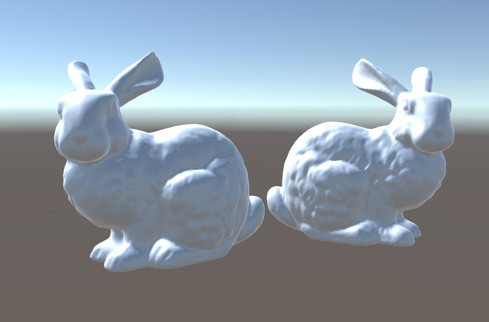

# Sample: Draco Decoding

This sample decodes and displays a Draco&trade; mesh at runtime. Its scripts serve as a blueprint to create your own decoding logic.

## Install the sample

When you select *Draco for Unity* in the Package Manager, you'll be able to click on the *Samples* tab to see the list of samples. Find the *Draco Decoding* sample and click its *Import* button.

Its content will get imported into the sample folder `Assets/Samples/Draco for Unity/<package version>/Draco Decoding`.

## Run the sample

Open the scene *DracoDecode* from the sample folder. You'll notice two GameObjects of interest, which have a component of identical name respectively on them:

1. *DecodeDracoToMesh*
2. *DecodeDracoToMeshData*

Both reference `bunny.drc.bytes`, a [TextAsset](xref:UnityEngine.TextAsset) containing a Draco compressed variant of the Stanford bunny.

If you enter Play Mode, both of those scripts will decode the asset and display it by assigning it to their [MeshFilter](xref:UnityEngine.MeshFilter)

## Troubleshooting

If you're not using the built-in render pipeline, the meshes render in solid pink to indicate a shader problem. Replace the material used on GameObjects *DecodeDracoToMesh* and *DecodeDracoToMeshData* with a valid material fit for your render pipeline and it should then render correctly.

## Trademarks

*Unity* is a registered trademark of [*Unity Technologies*][unity].

*Draco&trade;* is a trademark of [*Google LLC*][GoogleLLC].

[GoogleLLC]: https://about.google/
[unity]: https://unity.com
