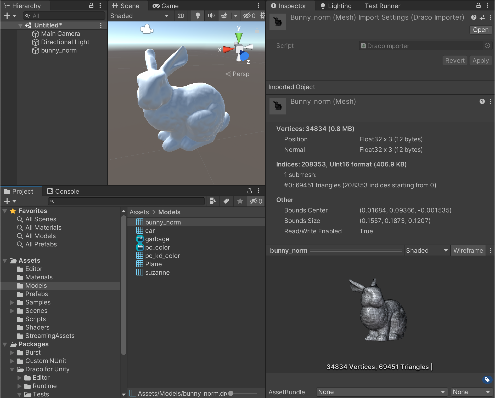

# Use case: Editor Import

Draco&trade; files can be used in the Unity Editor directly.

> **Note:** Draco compression can introduce artifacts due to loss of precision to mesh data. If feasible always prefer to use uncompressed original files and formats.

Reasons for such a use-case could be:

- Reduce the project size (at the cost of quality/precision).
- Not to include the meshes in builds, but as a means to inspect Draco data.

## Before you start

Make sure you have *Draco for Unity* [installed](installation.md).

## Import Draco files

You can import Draco&trade; files into the Unity Editor by copying them into the [*Assets*](xref:ImportingAssets) folder. It'll get imported as a Unity [Mesh](xref:UnityEngine.Mesh) that can be dropped into a scene right away.

> **Note:** Once imported to a Unity [Mesh](xref:UnityEngine.Mesh), the asset is no longer compressed (loses the size advantage) and does not require decoding at run-time.

## Trademarks

*Unity* is a registered trademark of [*Unity Technologies*][unity].

*Draco&trade;* is a trademark of [*Google LLC*][GoogleLLC].

[GoogleLLC]: https://about.google/
[unity]: https://unity.com
